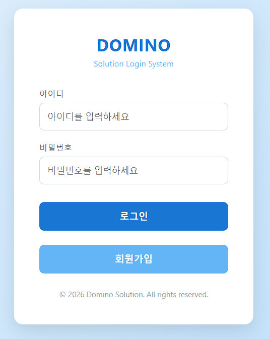
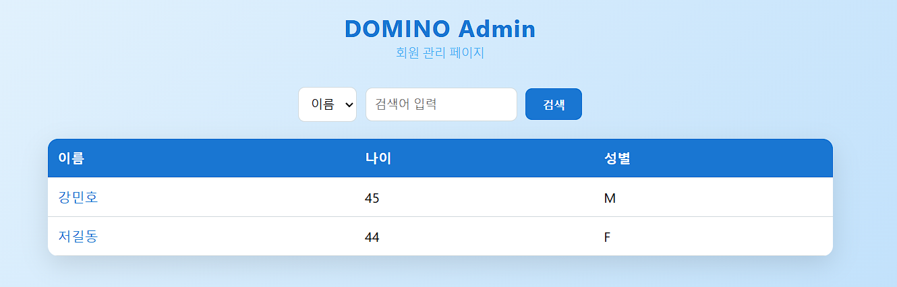
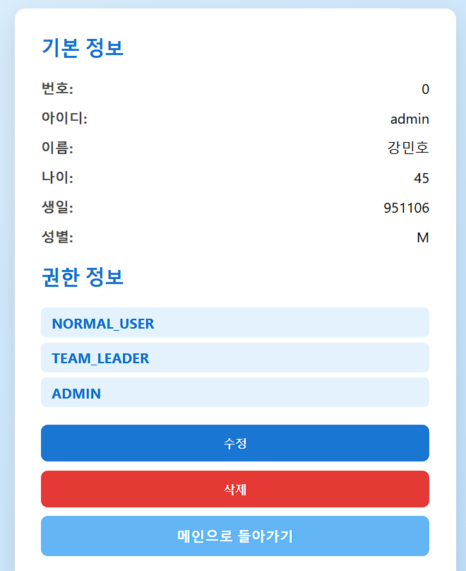

# 📌 Domino Solution 회원관리 시스템

## 📝 프로젝트 소개
MyBatis를 이용하여 구현한 **회원 관리 CRUD 기반 웹 애플리케이션**입니다.  
회원 가입 시 기본 권한을 부여하고, 로그인한 사용자의 권한에 따라  
**일반 사용자 페이지와 관리자 페이지를 분기 처리**하는 구조를 구현하였습니다.

관리자 계정은 사전에 데이터베이스에 등록되어 있으며,  
다중 권한(Role) 구조를 통해 **권한 기반 접근 제어의 개념**을 학습하는 데 목적이 있습니다.

또한 회원 삭제는 **소프트 딜리트(Soft Delete) 방식**으로 처리하여  
실무에서 자주 사용되는 데이터 관리 전략을 적용하였습니다.

도미노 솔루션은 제가 설정한 가상의 회사 이름입니다!

---

## 🛠 개발 환경

| 구분 | 내용 |
|---|---|
| OS | Windows 11 Home |
| IDE | Eclipse STS 5.0.1.RELEASE |
| SDK | Java SE 17 |
| Language Level | Java 17 |
| Spring Boot | 4.0.1 |
| ORM / Mapper | MyBatis |
| Lombok | v1.18.42 |
| 형상관리 도구 | Git, GitHub |
| Database | Oracle |

---

## ✨ 주요 기능

- 회원 가입 (기본 권한 `NORMAL_USER` 자동 부여)
- 로그인 / 로그아웃
- 회원 정보 조회
- 회원 정보 수정
- 회원 삭제 (Soft Delete)
- 권한(Role) 기반 페이지 분기 처리

---

## 🔐 권한(Role) 정책

### ▶ 일반 회원
- 회원 가입 시 `NORMAL_USER` 권한 자동 부여
- 로그인 시 일반 사용자 페이지로 이동

### ▶ 관리자 계정
- 데이터베이스에 사전 등록된 계정
- 보유 권한
  - `NORMAL_USER`
  - `TEAM_LEADER`
  - `ADMIN`
- 로그인 시 권한 목록에 `ADMIN`이 포함되어 있을 경우 관리자 페이지 접근 가능

---

## 🔄 로그인 및 권한 분기 처리

- 로그인 성공 시 사용자와 auth 테이블을 조인하여 권한을 검색
- 권한 목록 중 `ADMIN` 포함 여부를 기준으로 화면 분기
  - `ADMIN` 포함 → 관리자 페이지
  - 미포함 → 일반 사용자 페이지

> 권한 기반 접근 제어의 기본 개념을 학습하기 위한 구조입니다.

---

## 🗄 데이터베이스 설계

### 📌 회원 테이블 (dominoMember)

```sql
drop table dominoMember;

CREATE TABLE dominoMember(
    NO NUMBER,
    id VARCHAR2(100) NOT NULL,
    pw VARCHAR2(1000) NOT NULL,
    name VARCHAR2(50) NOT NULL,
    age NUMBER NOT NULL,
    birthday NUMBER NOT NULL,
    gender VARCHAR2(10) NOT NULL,
    enabled NUMBER DEFAULT 1,
    
    constraint domino_member_pk primary KEY (NO)
);

desc dominoMember;
```

### 📌시퀀스 생성
```
drop sequence dominoMember_seq;

create sequence dominoMember_seq
start with 1
increment by 1;
```

### 📌 권한 테이블 (memberAuth)
```
drop table memberAuth;

create table memberAuth(
    no NUMBER,
    auth VARCHAR2(20),
    
    constraint memberAuth_no_fk 
    foreign key (no) references dominomember(no)
);
```
## 📸 실행 화면

### 🏠 메인 화면


### 📋 회원 목록 화면


### 👤 회원 상세 화면



### 🚀 프로그램 흐름


### 🧩 삭제 정책 (Soft Delete)

-회원 삭제 시 실제 데이터 삭제 ❌<br>
-enabled 컬럼 값을 변경하여 비활성화 처리<br>
-데이터 복구 및 이력 관리가 가능하도록 설계

### ⚠️ 부족한 점 및 개선 예정 사항

회원 수정 페이지에서
권한 버튼에 마우스를 올릴 경우 삭제(X)<br>버튼을 노출하고
저장 시 권한을 수정하는 UI를 구현하고자 했으나,<br>
JavaScript 및 React에 대한 이해 부족으로 구현하지 못 하였음.

세션 및 권한 관리에 대한 이해 부족으로
권한 비교를 단순히 equals("ADMIN") 방식으로 처리함<br>
→ 추후 Spring Security 기반 권한 관리 방식으로 개선 예정


